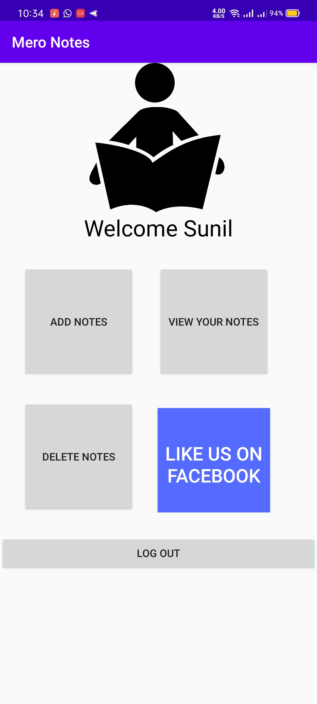

# assignment-android-login

In this Assignment, I have created an android application with splash activity with a progress bar and create login and signup UI and check basic validation, and setup simple profile UI

[//]: # (Video insert)

<!-- blank line -->

<iframe src="https://www.youtube.com/watch?v=dCjTS9M6y2U" height="200" width="300" title="Assignment"></iframe>

<!-- blank line -->

 
#splash screen

<!-- blank line -->

<!-- blank line -->

#signup 

<!-- blank line -->

<!-- blank line -->

#validation
<!-- blank line -->

<!-- blank line -->
#login screen

<!-- blank line -->

<!-- blank line -->
#user profile
<!-- blank line -->

<!-- blank line -->
